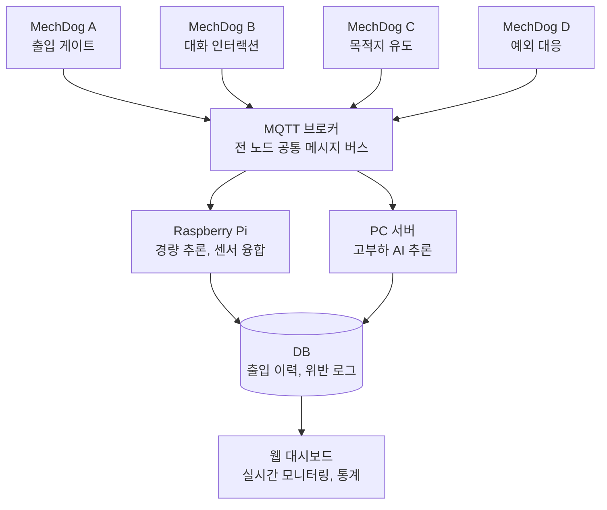

# MechDog 출입 통제 시스템 — 프로젝트 정리

## 1. 회의록 요약

**일시** 2026-09-02(수) 12:00
**안건** 상황 설정 / MechDog 역할 지정 / 팀원 역할 분담
**참석** 여도훈, 김별이, 최현수, 백경률

**결정 사항**

- 시스템 목적: 인가된 얼굴 + 안전복장 확인 → 목적지 에스코트, 미인가·복장불량 시 경고 대응
- MechDog 4대(A~D)에 기능 분리 배치, 팀원 1인 1대 담당
- 연산 계층 분리: MechDog 온보드 → Raspberry Pi → PC(고연산)
- 통신 규격: MQTT 단일 버스
- 배포: 팀원별 Docker 이미지 빌드 → 최종 통합은 **최현수** 노트북

---

## 2. 시나리오 정의

### 정상 플로우

1. 방문자 게이트 접근 감지 (A)
2. 얼굴 인식 → 등록자 DB 대조 → 인가 판정 (A)
3. 안전모·안전조끼 착용 여부 판정 (A)
4. 두 조건 통과 시 B에게 세션 인계
5. B가 음성으로 방문 목적 질의 → 목적지 확정 (B)
6. C가 인계받아 목적지까지 에스코트 → 도착 모션 + 안내 멘트 (C)
7. 전 과정 로그 DB 적재 → 대시보드 표출

### 예외 플로우

- 미인가 얼굴 → D 출동, 경고 자세 + 경고음, 대시보드 알림
- 안전모 미착용 → D 경고 자세, 재착용 유도 후 재검사 요청
- 얼굴 미검출 / 신뢰도 미달 → B가 재촬영 유도 (3회 실패 시 D로 이관)
- 에스코트 중 이탈 → C가 정지 후 D 호출

> 미확정: 재시도 횟수, 신뢰도 임계값, 경고 해제 조건

---

## 3. 전체 파이프라인

핵심은 MechDog가 원시 데이터(프레임·오디오)를 MQTT에 그대로 싣지 않는다는 점입니다. 이미지·오디오는 공유 볼륨에 저장하고 MQTT에는 **파일 경로만** 실어 보냅니다. 안 그러면 브로커가 먼저 죽습니다.

---

## 4. MechDog 파트별 상세

### A) 비전 인지 · 출입 게이트 — 여도훈

**사용 기술**

| 기술 | 사용 방식 |
|---|---|
| OpenCV | 카메라 프레임 캡처, 리사이즈·정규화 등 전처리. 5fps 정도로 다운샘플해서 부하를 낮춥니다. |
| 얼굴 인식 (InsightFace / ArcFace) | 얼굴을 512차원 임베딩 벡터로 변환. 등록자 벡터와 코사인 유사도를 계산해 임계값(0.5~0.6 권장)을 넘으면 인가로 판정. 분류 모델을 새로 학습하는 게 아니라 벡터 비교라서, 인원 추가 시 재학습 없이 벡터만 추가하면 됩니다. |
| YOLO (v8/v11) | 안전모·안전조끼 객체 검출. 클래스는 `helmet`, `vest`, `person` 3개로 두고, person bbox 안에 helmet/vest가 있는지를 IoU로 매칭해 "이 사람이 착용했는지"를 판정합니다. 단순히 화면에 헬멧이 보이는지만 보면 옆사람 헬멧을 잡습니다. |
| ONNX Runtime | 학습된 PyTorch 모델을 ONNX로 변환해 추론. CPU/GPU 어디서든 같은 파일로 돌아가서 Pi와 PC 양쪽 테스트가 편합니다. |
| ESP32 | 게이트 LED·부저 제어, 근접센서(PIR/초음파)로 접근 감지 트리거. 연산은 안 하고 I/O 게이트웨이 역할만 맡깁니다. |
| paho-mqtt | 판정 결과 발행. Python MQTT 클라이언트 표준 라이브러리. |

**할 일**

- 얼굴 등록 데이터셋 구축 (인당 10장 이상, 조명·각도 변화 포함)
- 얼굴 임베딩 DB 생성 및 유사도 임계값 튜닝
- 안전복장 데이터 라벨링 및 YOLO 학습 (공개 PPE 데이터셋 + 자체 촬영본 혼합)
- 부분 가림·측면 각도에서의 오탐 테스트
- 다중 인원 동시 진입 시 처리 규칙 (1명씩 큐잉 권장)
- 게이트 개폐 신호 출력 (실제 게이트 없으면 LED·부저로 대체)
- A→B 세션 인계 메시지 발행

### 추가 역할: 통신 서버 관리 — 여도훈

| 기술 | 사용 방식 |
|---|---|
| Mosquitto | 경량 MQTT 브로커. Docker 공식 이미지로 띄우고 설정 파일만 마운트하면 끝. |
| QoS 정책 | 상태 스트림처럼 흘려보내도 되는 건 QoS 0, 판정 결과·경고처럼 유실되면 안 되는 건 QoS 1. QoS 2는 오버헤드가 커서 이 규모에선 불필요. |
| Retain | 마지막 상태값을 브로커가 들고 있다가 새로 접속한 클라이언트에게 즉시 전달. 대시보드가 켜지자마자 현재 상태를 보려면 필요합니다. |
| LWT (Last Will) | 노드가 비정상 종료되면 브로커가 대신 "이 노드 죽었음" 메시지를 발행. MechDog 연결 끊김 감지에 씁니다. |

**할 일**: 토픽 네이밍 규칙 확정·문서화, 클라이언트 ID 규칙, 인증(username/password) 설정, 브로커 컨테이너화

---

### B) 대화형 인터랙션 — 김별이

**사용 기술**

| 기술 | 사용 방식 |
|---|---|
| STT (faster-whisper) | 방문자 음성 → 텍스트. MechDog 마이크 → 오디오 버퍼 → PC의 STT 엔진으로 전송해 텍스트 반환. 온보드로는 불가능한 연산이라 PC 계층 담당. `small` 모델이면 한국어도 충분합니다. |
| VAD (Silero VAD / webrtcvad) | 언제 말이 시작되고 끝났는지 검출. 이게 없으면 무음까지 계속 STT에 넣게 되어 지연과 오인식이 생깁니다. |
| TTS (Piper) | 안내 문구를 음성으로 출력. 고정 멘트("방문 목적을 말씀해 주세요")는 미리 wav로 생성해 캐싱하고 재생만 합니다. 실시간 합성은 목적지명처럼 가변인 부분만. |
| Intent / Slot 추출 | 발화 텍스트에서 방문 목적과 목적지를 뽑아냄. 목적지 후보가 10개 내외로 고정이면 키워드 룰 매칭으로 충분하고, 그게 부족할 때만 소형 LLM을 붙이는 순서로 갑니다. |
| ESP32 + I2S | 마이크(INMP441)와 스피커(MAX98357A)를 I2S로 연결해 제어. Wi-Fi 내장이라 ESP32에 MQTT 클라이언트를 직접 올려 오디오 이벤트를 publish할 수 있습니다. |
| 얼굴인식 (추적용) | B에서는 신원 판정이 아니라 대화 상대 추적용. A가 판정한 `visitor_id`를 세션으로 물려받고, 얼굴이 프레임에서 사라지면 대화 세션을 타임아웃 종료합니다. |
| MQTT | `gate/session`을 subscribe해 A로부터 세션 인계, 확정된 목적지를 `dialog/result`로 publish해 C와 DB에 전달. |

**할 일**

- 발화 시나리오 스크립트 작성 (질문 → 재질문 → 실패 안내, 3단계)
- 목적지 후보 리스트 정의 및 발화→목적지 매핑 규칙
- STT 오인식 대비 확인 절차 ("2층 회의실 맞으십니까?")
- 소음 환경 테스트 및 VAD 임계값 조정
- 응답 지연 목표치 설정 (발화 종료 후 2초 이내 권장)

### 추가 역할: 통합 데이터 규약 API — 김별이

| 기술 | 사용 방식 |
|---|---|
| FastAPI | 대시보드가 DB를 조회할 REST 엔드포인트 제공. 코드에서 자동으로 Swagger 문서가 생성돼서 팀원 간 규약 공유가 편합니다. |
| Pydantic | JSON 메시지 구조를 Python 클래스로 정의하고 자동 검증. 필드 누락·타입 오류를 런타임이 아니라 수신 즉시 잡아냅니다. 이 정의 파일을 팀 전체가 import해 쓰면 규약이 코드로 강제됩니다. |
| Git 브랜치 규칙 | 스키마 파일은 별도 저장소나 공용 디렉토리에 두고, 변경 시 PR로만 반영. 각자 로컬에서 필드 추가하면 통합 때 반드시 깨집니다. |

**할 일**: 메시지 스키마 소유·버전 관리, 공용 enum 상수 파일 배포, REST 엔드포인트 정의

---

### C) 목적지 유도 · 에스코트 — 최현수

**사용 기술**

| 기술 | 사용 방식 |
|---|---|
| ArUco 마커 (OpenCV aruco) | 실내 위치 추정. 벽·바닥에 마커를 붙여두고 카메라로 인식해 절대 좌표를 얻습니다. 본격 SLAM은 이 프로젝트 규모에 과합니다 — LiDAR도 없고 튜닝에만 몇 주 걸립니다. 마커 방식이면 하루면 붙습니다. |
| 웨이포인트 + A* | 목적지까지 경로 생성. 실내 맵을 격자로 만들 필요 없이, 복도 분기점마다 웨이포인트를 찍고 그 사이를 잇는 방식이 훨씬 단순합니다. |
| 거리 센서 (VL53L0X / HC-SR04) | 전방 장애물 감지. ToF 센서인 VL53L0X가 초음파보다 정확하고 반응이 빠릅니다. ESP32에 물려 I2C로 읽습니다. |
| YOLO person 검출 | 방문자 추종 확인. bbox의 세로 크기로 대략적 거리를 추정하고, 일정 크기 이하로 작아지면 뒤처졌다고 판단해 정지·대기합니다. |
| MechDog SDK 모션 | 도착 모션 시퀀스 (앉기, 방향 지시 자세). 미리 정의된 모션을 조합해 재생. |
| MQTT | `escort/status`를 1Hz로 주기 발행해 대시보드와 DB가 실시간 위치를 추적. |

**할 일**

- 실내 맵 정의 (목적지 ID ↔ 좌표 테이블, 마커 배치 계획)
- 경로 생성 및 주행 제어, 장애물 회피 로직
- 추종 거리 임계값 설정, 초과 시 정지·대기·D 호출
- 도착 모션 시퀀스 및 안내 멘트 출력
- 비상 정지 조건 정의

### 추가 역할: DB — 최현수

| 기술 | 사용 방식 |
|---|---|
| PostgreSQL | 출입 이력, 위반 로그, 등록자, 에스코트 이력 저장. Docker 공식 이미지 그대로 쓰면 됩니다. MariaDB도 무방하나 팀 내 익숙한 쪽으로 통일. |
| SQLAlchemy | Python ORM. 테이블을 클래스로 정의하고 마이그레이션 관리. 직접 SQL 문자열 조합하는 것보다 실수가 적습니다. |
| MQTT→DB 브릿지 | paho-mqtt로 전 토픽을 `#` 와일드카드 구독하고, 수신 메시지를 그대로 테이블에 적재하는 상시 실행 서비스. |
| Docker Volume | 이미지·오디오는 BLOB으로 DB에 넣지 말고 볼륨에 파일로 저장, DB에는 경로만. DB 크기가 순식간에 불어납니다. |

**할 일**: 테이블 설계, 브릿지 서비스 작성, 초기 시드 데이터, 백업 스크립트, 최종 통합 환경 구성

---

### D) 보안관제 · 예외 상황 대응 — 백경률

**사용 기술**

| 기술 | 사용 방식 |
|---|---|
| 상태 머신 (transitions) | 경고 로직을 `대기 → 감지 → 접근 → 경고 → 해제` 상태로 명시적으로 관리. if문 중첩으로 짜면 "경고 중에 또 다른 위반이 들어왔을 때" 같은 케이스에서 반드시 꼬입니다. |
| 객체 추적 (ByteTrack / SORT) | 위반자에게 고유 `track_id`를 부여해 프레임이 바뀌어도 같은 사람으로 유지. 이게 없으면 같은 사람에게 경고를 매 프레임 다시 겁니다. |
| ESP32 (부저 + LED 스트립) | 레벨별 경고 출력. 주의는 노란 LED + 짧은 비프, 경고는 빨간 점멸 + 연속음 같은 식으로 하드웨어 신호를 분리합니다. |
| MechDog 모션 | 경고 자세 시퀀스 (짖는 모션, 위협 자세, 대상 방향 추적). |
| 스냅샷 저장 | 위반 시점 프레임을 공유 볼륨에 저장하고 경로만 MQTT로 전달. |
| MQTT | A의 `vision/face`, `vision/ppe`를 구독해 트리거를 받고, `alert/event`를 발행. |

**할 일**

- 경고 트리거 조건 정의 (`authorized=false` 또는 `ppe.pass=false`)
- 경고 레벨 분리: 복장 불량(주의) vs 미인가 침입(경고)
- 레벨별 동작 시퀀스 정의
- 경고 해제 조건 (재검사 통과 / 대시보드에서 관리자 수동 해제)
- 오탐 시 즉시 중단할 킬스위치

### 추가 역할: 대시보드 — 백경률

| 기술 | 사용 방식 |
|---|---|
| React + Vite | 프론트엔드. 실시간 갱신이 많아 컴포넌트 단위 리렌더가 유리합니다. 팀에 프론트 경험이 없으면 Flask + HTMX 조합이 훨씬 빠릅니다 — 화면 몇 개짜리면 그걸로 충분. |
| MQTT over WebSocket (mqtt.js) | 브라우저가 MQTT 브로커에 직접 구독. 백엔드 폴링 없이 실시간 알림을 받습니다. Mosquitto 설정에서 WebSocket 리스너(9001 포트)를 열어둬야 합니다. |
| Chart.js | 일별 출입 건수, 위반 유형별 통계 등 시각화. |
| FastAPI 조회 API | 과거 이력 조회·필터는 실시간이 아니므로 김별이가 만든 REST 엔드포인트로 가져옵니다. |

**할 일**: 실시간 출입 현황·경고 알림·MechDog 상태 표시, 이력 조회 및 필터, 스냅샷 뷰어, 경고 수동 해제 버튼

---

## 5. Docker 구성

### 컨테이너는 6개로

컨테이너를 나누는 기준은 "기능이 다르니까"가 아니라 다음 셋 중 하나여야 합니다.

- 독립적으로 재시작·스케일해야 하는가
- 의존성이 충돌하는가 (예: 특정 CUDA 버전이 필요한 추론 서비스 vs 웹 서버)
- 담당자가 달라서 따로 빌드해야 하는가

이 프로젝트에서 실질적으로 걸리는 건 세 번째뿐입니다. 팀원 1인당 1컨테이너 + 인프라 2개, 총 6개를 권합니다.

| 컨테이너 | 담당 | 내용 | 빌드 필요 |
|---|---|---|---|
| `mosquitto` | 여도훈 | MQTT 브로커 | 공식 이미지 + 설정 파일만 |
| `vision-service` | 여도훈 | 얼굴 인식 + PPE 검출 | O |
| `dialog-service` | 김별이 | STT/TTS/intent + 규약 API | O |
| `escort-service` | 최현수 | 에스코트 로직 + MQTT→DB 브릿지 | O |
| `security-dashboard` | 백경률 | 경고 상태머신 + 대시보드 서버 | O |
| `postgres` | 최현수 | DB | 공식 이미지 |

**합친 근거**

- `db-bridge`는 DB 담당인 최현수 것이고 코드도 수십 줄이라 `escort-service`에 함께 둡니다.
- `security-service`와 `dashboard`는 둘 다 백경률이고, 경고 이벤트를 대시보드로 밀어주는 관계라 프로세스를 나눌 이유가 없습니다.
- `mosquitto`와 `postgres`는 공식 이미지라 빌드 대상이 아니고, compose에 선언만 하면 됩니다.

**단, 이건 나눠야 합니다**: `vision-service`와 `dialog-service`는 합치지 마세요. 둘 다 무거운 모델을 올리고 GPU 메모리를 잡는데, 하나가 죽으면 같이 내려갑니다. 담당자도 다릅니다.

**MechDog 온보드 코드와 ESP32 펌웨어는 컨테이너 대상이 아닙니다.** 하드웨어에 직접 플래시하는 것들이라, Docker 통합 논의에서는 빼고 별도 배포 절차로 관리합니다.

### 통합 전에 합의해둘 것

- 베이스 이미지 통일 (`python:3.11-slim`) — 여기서 안 맞추면 통합 때 의존성 충돌 해결에 시간을 다 씁니다
- 컨테이너 이름 = MQTT 클라이언트 ID = 서비스명으로 통일
- 포트 사전 배정: 브로커 1883, WebSocket 9001, 대시보드 3000, DB 5432
- `.env` 템플릿 공유 (브로커 주소, DB 접속정보)
- 공유 볼륨 경로 통일 (`/data/snap`, `/data/audio`)
- 이미지 전달은 레지스트리보다 `docker save` / `docker load`가 팀 내부용으로는 간단합니다
